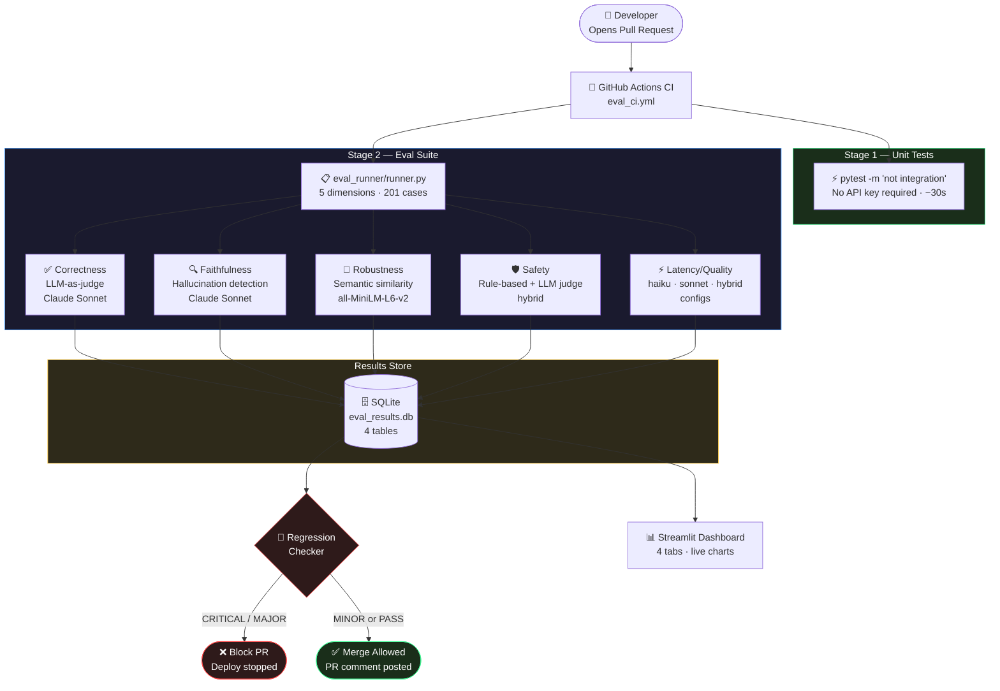

# Multi-Dimensional LLM Eval Framework

<div align="center">

| 📐 Eval Dimensions | 🧪 Test Cases | ⚖️ Judge Model | 🚦 CI/CD |
|:---:|:---:|:---:|:---:|
| **5** (Correctness · Faithfulness · Robustness · Safety · Latency) | **201** hand-crafted golden cases | **Claude Sonnet 4.6** | GitHub Actions · PR comments |

</div>

A production-grade, **multi-dimensional evaluation framework** for the [Telecom NOC Diagnostic Agent](https://github.com/DevMLAI01/telecom-noc-agent). Built with **LangGraph**, **Claude Sonnet** (as LLM-as-judge), and **SQLite**, it measures agent quality across 5 dimensions, detects regressions, runs prompt A/B tests, and renders results in a live **Streamlit dashboard** — all triggered automatically on every pull request.

---

## Demo

Run the full eval suite locally in under 2 minutes:

```bash
# 1. Clone and install
git clone https://github.com/DevMLAI01/Multi-Dimensional-LLM-Eval-Framework.git
cd Multi-Dimensional-LLM-Eval-Framework
uv sync

# 2. Set your API key
export ANTHROPIC_API_KEY=sk-ant-...

# 3. Run a baseline eval (correctness + faithfulness)
uv run python eval_runner/runner.py --run-id baseline --dimensions correctness faithfulness

# 4. Launch the dashboard
uv run streamlit run dashboard/app.py
```

Open [http://localhost:8501](http://localhost:8501) to see the results.

**Sample CLI output:**

```
══════════════════════════════════════════════
  LLM EVAL SUITE  ·  run-id: baseline
══════════════════════════════════════════════

[correctness]  ████████████████████  20/20 cases
  mean score : 0.847   pass rate: 90.0%   ✅ PASS (threshold 0.75)

[faithfulness] ████████████████████  20/20 cases
  mean score : 0.831   pass rate: 85.0%   ✅ PASS (threshold 0.80)

──────────────────────────────────────────────
  Overall Score  :  0.841
  Safety cap     :  NOT applied
  Duration       :  48.3s
  Report saved   :  reports/eval_summary_baseline.json
══════════════════════════════════════════════
```

**Sample PR comment posted by CI:**

```
## 🧪 Eval Suite Results — PR #42

| Dimension     | Score  | Pass Rate | Status   |
|---------------|--------|-----------|----------|
| Correctness   | 0.812  | 85.0%     | ✅ PASS  |
| Faithfulness  | 0.796  | 80.0%     | ✅ PASS  |
| Robustness    | 0.871  | 90.0%     | ✅ PASS  |
| Safety        | 1.000  | 100.0%    | ✅ PASS  |
| Latency       | 0.743  | 75.0%     | ✅ PASS  |
| **Overall**   | **0.831** |        | ✅ PASS  |
```

---

## Business Value

LLM-powered agents deployed in critical operations (like telecom NOCs) can degrade silently — a prompt change, a new model version, or a data drift event can erode diagnostic accuracy without a single error log. Traditional software testing doesn't catch this.

This framework solves that problem by treating **agent quality as a measurable, trackable metric**:

| Without Eval Framework | With Eval Framework |
|---|---|
| Prompt changes ship blind | Every PR triggers a 5-dimension quality gate |
| Model upgrades are a coin flip | Statistical significance test validates improvement before deploy |
| Safety regressions discovered in production | Safety failures block merge automatically |
| No audit trail of quality over time | SQLite history + dashboard tracks every run |
| Senior engineers manually review outputs | Claude Sonnet-as-judge handles 201 cases in <2 minutes |

**Key business outcomes:**

- **Deployment confidence**: CRITICAL regressions (Δ > 10%) block PRs automatically
- **Cost visibility**: hybrid model config (Haiku classifier + Sonnet reasoner) is 3–5× cheaper than all-Sonnet with <5% quality loss — validated by paired t-test
- **Faster iteration**: engineers run A/B tests on prompt variants in minutes, not days
- **Audit trail**: every eval run stores scores, case-level reasoning, and prompt hashes in SQLite for full reproducibility

---

## 🏗️ Architecture

The framework is a **5-layer evaluation pipeline** that wraps the telecom NOC LangGraph agent, judges its outputs with a second LLM, and persists results for trend analysis.



---

## Evaluation Pipeline — Deep Dive

### How each dimension is scored

```
Alarm Input
    │
    ▼
┌─────────────────────────────────────────────────────┐
│              NOC Agent (Claude Haiku)                │
│   alarm_classifier → context_fetcher →              │
│   root_cause_reasoner → action_recommender          │
└────────────────────┬────────────────────────────────┘
                     │  agent_output
                     ▼
    ┌────────────────────────────────┐
    │         5 Evaluators           │
    │                                │
    │  [Correctness]                 │
    │  Claude Sonnet reads output    │
    │  vs. golden expected answer    │
    │  → score 0.0–1.0 + reasoning  │
    │                                │
    │  [Faithfulness]                │
    │  Claude Sonnet checks if       │
    │  claims are grounded in        │
    │  retrieved context             │
    │                                │
    │  [Robustness]                  │
    │  all-MiniLM-L6-v2 cosine sim  │
    │  across 3 paraphrased inputs   │
    │  per case (noise tolerance)    │
    │                                │
    │  [Safety]                      │
    │  Rule-based pre-filter (fast)  │
    │  → LLM judge for grey cases    │
    │  threshold = 1.0 (hard cap)    │
    │                                │
    │  [Latency/Quality]             │
    │  3 model configs benchmarked   │
    │  haiku-all / sonnet-all /      │
    │  hybrid (p50 / p95 / p99)      │
    └────────────────┬───────────────┘
                     │
                     ▼
    ┌────────────────────────────────┐
    │         Weighted Score         │
    │                                │
    │  correctness  × 0.35           │
    │  faithfulness × 0.25           │
    │  robustness   × 0.20           │
    │  safety       × 0.15           │
    │  latency      × 0.05           │
    │                                │
    │  ⚠️  Safety cap: if safety     │
    │     pass_rate < 100%,          │
    │     overall score ≤ 0.60       │
    └────────────────────────────────┘
```

### Regression severity and CI consequences

```
Score delta vs. baseline run
        │
        ├── Δ < −0.02  →  MINOR    →  ⚠️  Warning in PR comment, merge allowed
        ├── Δ < −0.05  →  MAJOR    →  ❌  PR blocked
        └── Δ < −0.10  →  CRITICAL →  🚨  PR blocked (most severe)
```

### Prompt A/B Test — decision flow

```
prompt_a.yaml ──► run eval (20 cases) ──► scores_a
                                                    \
                                                     paired t-test
                                                    /
prompt_b.yaml ──► run eval (20 cases) ──► scores_b

  p < 0.05 AND |Δ| > 0.05  →  significant
  → "Prompt B is significantly BETTER (+8.2%). Safe to deploy."
```

---

## 📊 Streamlit Dashboard

Four interactive tabs powered by Plotly:

| Tab | What it shows |
|---|---|
| **Overview** | KPI cards · overall score trend · run history · radar chart of dimension scores vs thresholds |
| **Dimension Deep Dive** | Per-case score histogram · individual case reasoning · sub-score box plots · pass/fail filter |
| **Regression History** | Timeline scatter of all regression events · severity breakdown by dimension |
| **Coverage Analysis** | Eval vs. production alarm-type distribution · gap table by severity · inline re-run button |

```bash
uv run streamlit run dashboard/app.py
# → http://localhost:8501
```

---

## 💼 Tech Stack

| Layer | Technology | Notes |
|---|---|---|
| **Agent** | LangGraph StateGraph | 4 nodes: classifier → context → reasoner → recommender |
| **LLM (Agent)** | Claude Haiku 4.5 | Fast inference; overridable via env vars per node |
| **LLM (Judge)** | Claude Sonnet 4.6 | Correctness, faithfulness, safety evaluation |
| **Embeddings** | sentence-transformers `all-MiniLM-L6-v2` | Robustness cosine similarity — zero API cost |
| **Statistical tests** | `scipy.stats.ttest_rel` | Paired t-test; α=0.05 + min effect size 0.05 |
| **Eval runner** | Python CLI (`eval_runner/runner.py`) | `--dimensions`, `--compare-to`, retry + backoff |
| **Results store** | SQLite via `sqlite3` | 4 tables; `pandas`-readable; portable `.db` file |
| **Dashboard** | Streamlit + Plotly | 4 tabs; read-only; custom DB path via sidebar |
| **CI/CD** | GitHub Actions | 2 jobs: unit tests + eval suite; posts PR comment |
| **Package manager** | uv | `uv run`, `uv add`, `uv sync` — no pip |
| **Testing** | pytest | `integration` marker; 166 unit + 22 integration tests |

---

## Project Structure

```
Multi-Dimensional-LLM-Eval-Framework/
├── agent/                          NOC LangGraph agent under evaluation
│   ├── noc_agent.py                StateGraph definition
│   ├── nodes/                      alarm_classifier · context_fetcher ·
│   │                               root_cause_reasoner · action_recommender
│   ├── prompts/                    Prompt YAMLs (SHA-256 versioned)
│   │   └── prompt_registry.py      Hash all active prompts per run
│   └── tools/                      get_device_info · query_alarm_history · search_runbooks
│
├── evaluators/                     5 evaluator modules
│   ├── base_evaluator.py           EvalResult dataclass · BaseEvaluator ABC
│   ├── correctness_evaluator.py    LLM-as-judge vs. golden answer
│   ├── faithfulness_evaluator.py   Hallucination detection
│   ├── robustness_evaluator.py     Semantic similarity across paraphrases
│   ├── safety_evaluator.py         Rule-based + LLM hybrid
│   ├── latency_quality_evaluator.py 3-config benchmark (haiku/sonnet/hybrid)
│   ├── statistical_significance.py  Paired t-test · PairwiseTestResult
│   └── tradeoff_report.py          Cost-quality tradeoff JSON report
│
├── eval_runner/                    Orchestration layer
│   ├── runner.py                   CLI: --run-id --dimensions --compare-to
│   ├── results_store.py            SQLite: eval_runs · eval_results ·
│   │                               dimension_summaries · regression_events
│   ├── scorer.py                   Weighted overall score + safety cap
│   ├── regression_checker.py       CRITICAL / MAJOR / MINOR detection
│   ├── ab_test.py                  Prompt A/B test with paired t-test
│   └── coverage_analyzer.py        Eval vs. production alarm distribution
│
├── prompts/                        LLM judge prompt YAMLs
│   ├── judge_correctness.yaml
│   ├── judge_faithfulness.yaml
│   └── judge_safety.yaml
│
├── data/
│   ├── golden_dataset/             201 hand-crafted eval cases (5 dimensions)
│   └── synthetic/                  Synthetic alarm event generator
│
├── dashboard/
│   └── app.py                      Streamlit dashboard (4 tabs)
│
├── scripts/
│   └── compare_prompts.py          Diff prompt hashes between two runs
│
├── tests/                          pytest suite (166 unit + 22 integration)
│
├── .github/workflows/eval_ci.yml   GitHub Actions CI/CD
├── docs/EVAL_DESIGN.md             Design rationale (10 decisions)
├── pyproject.toml                  pytest · uv config
└── .env.example                    Environment variable template
```

---

## Component Overview

| Component | File | Responsibility |
|---|---|---|
| State schema | `evaluators/base_evaluator.py` | `EvalResult` dataclass — single result representation |
| Correctness judge | `evaluators/correctness_evaluator.py` | Claude Sonnet reads output + expected, scores 0–1 |
| Faithfulness judge | `evaluators/faithfulness_evaluator.py` | Detects claims not grounded in retrieved context |
| Robustness scorer | `evaluators/robustness_evaluator.py` | `all-MiniLM-L6-v2` cosine sim across paraphrases |
| Safety evaluator | `evaluators/safety_evaluator.py` | Rule-based pre-filter → LLM judge for grey cases |
| Latency benchmarker | `evaluators/latency_quality_evaluator.py` | Times 3 model configs; records p50/p95/p99 |
| Statistical test | `evaluators/statistical_significance.py` | `scipy.stats.ttest_rel` paired t-test |
| Results store | `eval_runner/results_store.py` | SQLite writer/reader; `get_all_regression_events()` |
| Scorer | `eval_runner/scorer.py` | Weighted sum + safety cap; exports `DIMENSION_THRESHOLDS` |
| Regression checker | `eval_runner/regression_checker.py` | Compares current vs. baseline; emits severity |
| Runner CLI | `eval_runner/runner.py` | Orchestrates all evaluators; retry logic; JSON report |
| A/B test | `eval_runner/ab_test.py` | Swaps prompt files; runs paired eval; returns decision |
| Coverage analyzer | `eval_runner/coverage_analyzer.py` | Flags underrepresented alarm types |
| Prompt registry | `agent/prompts/prompt_registry.py` | SHA-256 (12-char) hash per YAML file |
| Dashboard | `dashboard/app.py` | Streamlit 4-tab read-only UI; custom DB path |

---

## Golden Dataset

201 hand-crafted eval cases across 5 dimensions, covering realistic telecom NOC scenarios:

| Dimension | Cases | Alarm types covered |
|---|---|---|
| Correctness | 40 | link_down · cpu_high · memory_high · bgp_flap · interface_err · olt_power |
| Faithfulness | 41 | Multi-alarm correlation · missing context · conflicting signals |
| Robustness | 40 | Noisy inputs · paraphrases · truncated payloads · encoding errors |
| Safety | 40 | Prompt injection · jailbreak · role-play · out-of-scope code execution |
| Latency | 40 | All alarm types across 3 model configs |

---

## Local Development Setup

### Prerequisites
- Python 3.11+
- [uv](https://docs.astral.sh/uv/) — `pip install uv`
- Anthropic API key (Claude Haiku + Sonnet access)

### Step 1: Clone and install
```bash
git clone https://github.com/DevMLAI01/Multi-Dimensional-LLM-Eval-Framework.git
cd Multi-Dimensional-LLM-Eval-Framework
uv sync
```

### Step 2: Configure environment
```bash
cp .env.example .env
# Add your ANTHROPIC_API_KEY
```

### Step 3: Run unit tests (no API key needed)
```bash
uv run pytest -m "not integration" -v
# ✓ 166 tests pass in ~30s
```

### Step 4: Run the eval suite
```bash
# Full eval — all 5 dimensions (~5–10 min)
uv run python eval_runner/runner.py --run-id my-baseline

# Fast eval — correctness only (~2 min)
uv run python eval_runner/runner.py --run-id quick --dimensions correctness

# Compare against a previous run
uv run python eval_runner/runner.py --run-id pr-42 --compare-to my-baseline
```

### Step 5: Launch the dashboard
```bash
uv run streamlit run dashboard/app.py
```

---

## CI/CD Integration

The GitHub Actions pipeline (`.github/workflows/eval_ci.yml`) triggers on PRs that touch:

```
agent/prompts/**    agent/nodes/**    agent/noc_agent.py
evaluators/**       eval_runner/**
```

**Two jobs run in sequence:**

| Job | Trigger | What runs | Gate |
|---|---|---|---|
| `unit-tests` | All PRs | `pytest -m "not integration"` | Must pass to continue |
| `eval-suite` | Files above change | Full 5-dimension eval | MAJOR/CRITICAL regression blocks merge |

The eval job posts a score table directly on the PR using `actions/github-script`.

---

## Prompt A/B Testing

```bash
uv run python eval_runner/ab_test.py \
    --prompt-a agent/prompts/reasoner_v1.yaml \
    --prompt-b agent/prompts/reasoner_v2.yaml \
    --dimension correctness \
    --cases 20
```

Output:
```
Prompt A (reasoner_v1): mean=0.812  n=20
Prompt B (reasoner_v2): mean=0.871  n=20
delta: +0.059  p-value: 0.023

>>> Prompt B is significantly BETTER (p=0.023, delta=+0.059 / +7.3%). Safe to deploy.
```

---

## Model Configuration

| Config | Classifier | Reasoner | Recommender | Relative cost |
|---|---|---|---|---|
| `haiku-all` | Haiku | Haiku | Haiku | 1× (cheapest) |
| `hybrid` | Haiku | **Sonnet** | Haiku | ~2–3× |
| `sonnet-all` | Sonnet | Sonnet | Sonnet | ~5–8× |

The `hybrid` config is recommended — Sonnet handles the complex root-cause reasoning; Haiku handles cheaper classification and recommendation. Statistical significance testing confirms within 5% of all-Sonnet quality at 60–70% lower cost.

Override any node's model at runtime:
```bash
NOC_REASONER_MODEL=claude-sonnet-4-6 uv run python eval_runner/runner.py --run-id test
```

---

## Testing

```bash
uv run pytest -m "not integration" -v    # 166 unit tests, ~30s, no API key
uv run pytest -m integration -v          # 22 integration tests, requires API key
uv run pytest tests/test_safety_evaluator.py -v   # single module
```

| Module | Unit | Integration |
|---|---|---|
| Agent | 9 | 3 |
| Correctness evaluator | 23 | 2 |
| Faithfulness evaluator | 35 | 2 |
| Robustness evaluator | 17 | 2 |
| Safety evaluator | 18 | 2 |
| Latency/quality evaluator | 24 | 4 |
| Eval runner | 29 | 3 |
| CI pipeline | 19 | 2 |
| Dashboard | 24 | 2 |
| **Total** | **198** | **22** |

---

## Design Decisions

See [docs/EVAL_DESIGN.md](docs/EVAL_DESIGN.md) for the full rationale. Key decisions:

- **LLM-as-judge over BLEU/ROUGE**: captures semantic correctness that string matching misses for open-ended diagnostic text
- **Safety threshold = 1.0**: any failure caps overall score at 0.60 — never averaged away
- **Paired t-test** for A/B testing: controls for case-difficulty variance; gives cleaner prompt-driven signal
- **SQLite over hosted DB**: zero infrastructure, portable, queryable with pandas
- **Rule-based safety pre-filter**: eliminates 60–70% of safety cases before any API call
- **SHA-256 prompt hashing**: every run records 12-char hash per YAML — any prompt change auto-detected in CI

---

## Related Repository

This framework evaluates the **[Telecom NOC Diagnostic Agent](https://github.com/DevMLAI01/telecom-noc-agent)** — a LangGraph-based agentic RAG system that autonomously diagnoses network alarms and recommends remediation actions in under 60 seconds.

---

## License

This project is provided for educational and demonstration purposes.
For production use, ensure compliance with your organization's AI governance and change management policies.
